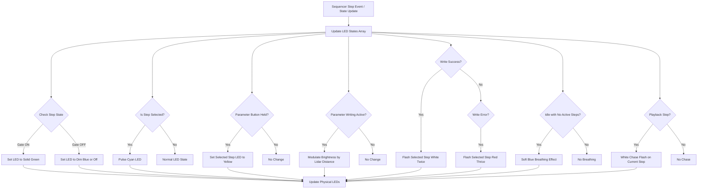

# LED Matrix RGB LED Feedback System Plan

## Overview

This document outlines the design and implementation plan for the RGB LED feedback system for the LED matrix controlling the sequencer steps in the Pico2DSP2CoreWorks project.

## Objectives

- Provide visual feedback on the LED matrix (LEDs 0-15) corresponding to the first 16 sequencer steps.
- Illuminate each button per step behind the physical buttons.
- Implement various LED behaviors reflecting sequencer states and user interactions.
- Ensure smooth transitions and clear, intuitive feedback.

## Integration

- Instantiate a single `LEDMatrix` object globally.
- Initialize the LED matrix in the Arduino `setup()` function with suitable brightness.
- Use the existing sequencer (`seq`) state and input events to drive LED updates.

## LED Mapping

- Map sequencer steps 0-15 to LED indices 0-15 in the LED matrix (linear mapping).
- Ensure consistent indexing between sequencer steps and LED positions.

## LED State Behaviors and Priority

| Priority | Condition                                | LED Behavior                                  |
|----------|----------------------------------------|-----------------------------------------------|
| 1        | Write success flash                     | Two rapid white flashes on selected step      |
| 2        | Write error flash                      | Three rapid red flashes on selected step      |
| 3        | Parameter writing active                | Brightness modulated by Lidar distance        |
| 4        | Parameter button held                   | Selected step LED turns yellow                 |
| 5        | Selected step                          | Pulsing cyan LED                               |
| 6        | Gate ON step                          | Solid green LED                                |
| 7        | Gate OFF step                         | Dim blue LED or off                            |
| 8        | Playback chase flash                   | Brief white flash moving with playhead        |
| 9        | Idle with no active steps              | Soft blue breathing effect                      |

## Animations and Timing

- Use `millis()` to manage animation timing, flashing intervals, and smooth pulsing/breathing effects.
- Implement utility functions for:
  - Pulsing (sine wave brightness modulation)
  - Breathing (slow fade in/out)
  - Flashing (rapid on/off)
  - Chase flash synchronized with sequencer clock
- Ensure non-blocking animations for smooth real-time updates.

## Lidar Distance Integration

- Map Lidar distance measurements to LED brightness during parameter writing.
- Provide immediate tactile feedback by adjusting LED intensity dynamically.

## Code Structure

- Maintain an LED state array representing current colors for LEDs 0-15.
- On sequencer step updates, parameter changes, or UI events, update LED state array accordingly.
- Create an animation update function called frequently in the main loop or step callback.
- Encapsulate LED update logic in dedicated functions for clarity and maintainability.
- Use the `LEDMatrix` class methods (`setLED`, `show`) to apply LED colors and refresh the display.

## Performance Considerations

- Minimize unnecessary LED updates; only refresh changed LEDs.
- Use efficient data structures and avoid blocking delays.
- Prioritize responsiveness for user interactions and sequencer events.

## Mermaid Diagram of LED State Update Flow

---

Please review this plan and confirm if you approve it or want any modifications. Upon approval, I can assist with implementation.