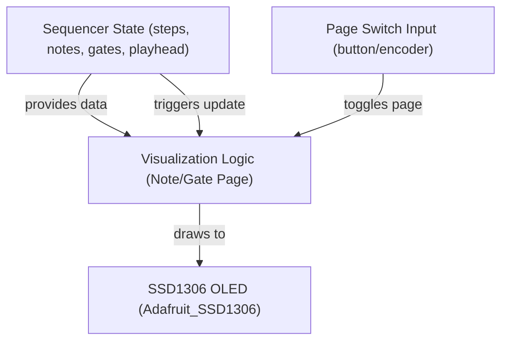

# 16-Step Sequencer Visualization Plan for SSD1306 OLED

_Last updated: 2025-05-31_

## 1. Display Requirements

- **Show all 16 steps at once** (no scrolling or paging for steps).
- **Two pages:**  
  - **Note Page:** Displays MIDI note numbers for each step.
  - **Gate Page:** Displays gate state (ON/OFF) for each step.
- **Page switching:** Use a button or encoder to toggle between Note and Gate pages.

---

### Prerequisites

- SSD1306 OLED display connected via SPI or I2C
- Adafruit_SSD1306 library installed
- Sequencer state API accessible (steps, notes, gates, playhead)

---

## 2. UI Layouts

### Note Page
- **Top Row:** Step numbers (0–15)
- **Bottom Row:** MIDI note numbers for each step
- **Playhead:** Highlighted step (e.g., underline or inverted color)

### Gate Page
- **Top Row:** Step numbers (0–15)
- **Bottom Row:** Gate state for each step (e.g., filled circle for ON, empty for OFF)
- **Playhead:** Highlighted step

---

## 3. Architecture & Data Flow



---

## 4. Implementation Steps

1. **Initialize Display**
   - Use Adafruit_SSD1306 with provided pinout.
   - Call `display.begin()` in setup.

2. **Expose Sequencer State**
   - Access steps, note numbers, gate states, and playhead index.

3. **Visualization Logic**
   - Draw 16 columns for steps.
   - On Note Page: Show step number and note number.
   - On Gate Page: Show step number and gate state (e.g., filled/empty circle).
   - Highlight playhead step.

4. **Page Switching**
   - Use a button or encoder to toggle between Note and Gate pages.
   - Debounce input and update display on page change.

5. **Update Trigger**
   - Redraw display on step advance, edit, or page switch.

6. **Performance**
   - Use smallest readable font for 16 columns.
   - Optimize drawing to minimize flicker.

---

## 5. Risks & Mitigations

- **Font Size:** 16 columns is tight; use 6x8 or custom bitmap font.
- **Input Debounce:** Ensure reliable page switching.
- **Display Refresh:** Optimize to avoid flicker.

---

## 6. Example UI Sketch

```
Note Page:
 0  1  2  3  4  5  6  7  8  9 10 11 12 13 14 15
60 62 64 65 67 69 71 72 60 62 64 65 67 69 71 72
 ^

Gate Page:
 0  1  2  3  4  5  6  7  8  9 10 11 12 13 14 15
●  ○  ●  ○  ●  ○  ●  ○  ●  ○  ●  ○  ●  ○  ●  ○
 ^

( ^ = playhead highlight, ● = gate ON, ○ = gate OFF )